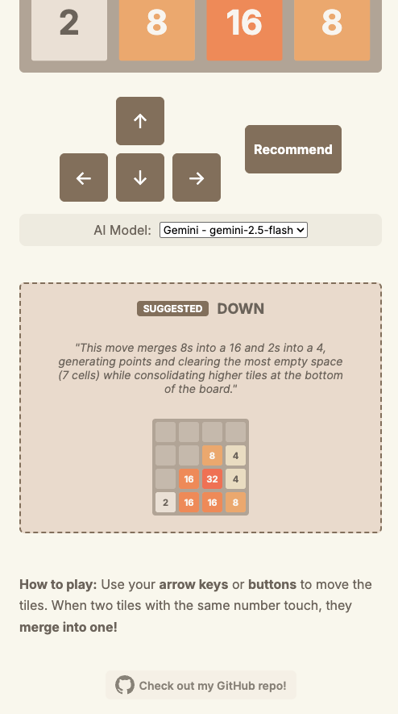

# khair-2048

A modular Python implementation of a **2048-style sliding tile game** with a **React-TypeScript** web interface - with a recommend feature.

<p align="center">
  
  &nbsp;&nbsp;&nbsp;&nbsp;&nbsp;
  
</p>

---

## Project Structure

This project is organized into two main components:

- **`backend/`**: Python backend.
  - Core game logic (grid management, tile movement, merging).
  - Recommendation Engine (using AI models like Gemini, Ollama, etc. or local heuristics).
  - FastAPI backend that serves the game logic and static assets.
- **`frontend/`**: Modern React-TypeScript frontend.

---

## Technical Details

- **Backend**: Python FastAPI (Stateless logic).
- **Frontend**: React 18, TypeScript, Vite.
- **Communication**: REST API (`/new`, `/move`, `/recommend`).
- **State**: Client-managed grid state, server-validated transitions.

### Core Assumptions

Based on standard 2048 mechanics:
- **Move Invariance**: A move is only finalized (turns incremented, new tile spawned) if it changes the board state. If no tiles can move or merge in the selected direction, the move is ignored.
- **Merging**: Only immediate merges are done, there are no chained merges.

---

## Quick Start (Recommended)

Run the entire application with a single command from the project root:

### Using Bash
```bash
./start.sh
```

*This script will automatically build the frontend and start the backend server.*

### Using Docker
```bash
# Build the image
docker build -t khair-2048 .

# Run the container
docker run -p 8000:8000 khair-2048
```
*The game will be available at `http://localhost:8000`.*

---

## Environment Variables

There are some optional environment variables required for maximum usage of the recommender.
If none of the variables here are specified, then the application will default to a simple heuristic recommender.

- `GEMINI_API_KEY`: Required for Google Gemini recommendations.
- `OLLAMA_HOST`: Optional URL for Ollama (default's to Ollama's local endpoint: `http://localhost:11434`).

---

## Individual Setup

### 1. Backend Setup (Python)
```bash
# run this in the project root directory
cd backend
python3 -m venv .venv
source .venv/bin/activate
pip install -e ".[dev]"
```

### 2. Frontend Setup (React/TS)
```bash
# run this in the project root directory
cd frontend
npm install
npm run build
```

### 3. Run backend (which serves the frontend package)
```bash
# run this in the project root directory
cd backend
python -m src.main
```

---

## Testing

### Backend (Pytest)
Run all backend tests from the `backend` directory:
```bash
# run this in the project root directory
cd backend
pytest
```

### Frontend (Vitest)
Run web tests from the `frontend` directory:
```bash
# run this in the project root directory
cd frontend
npm run test
```
