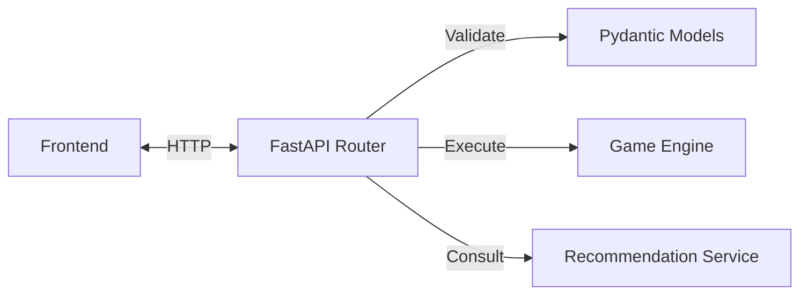
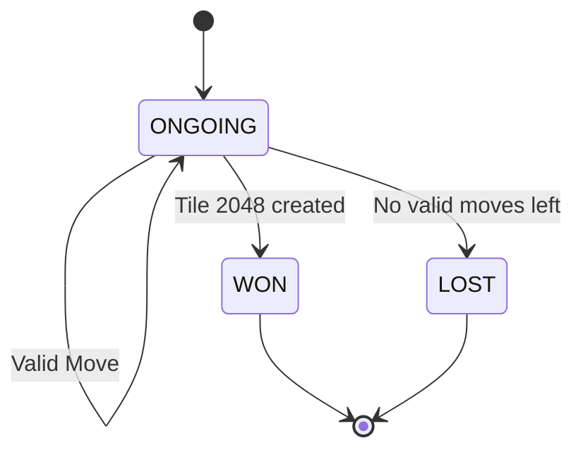
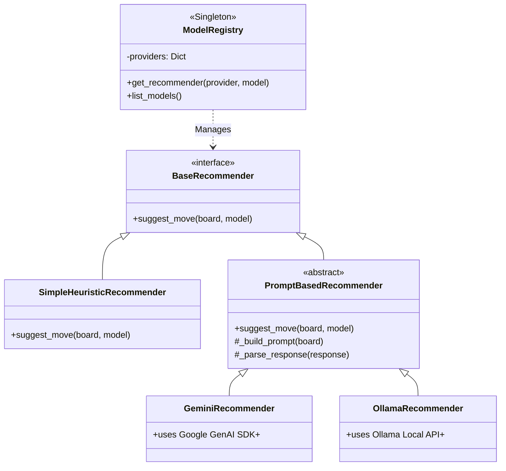

# Backend Schematics — 2048

This document details the architectural design, API specifications, and internal logic of the backend modules.

## Tech Stack

- **Framework**: FastAPI (Python 3.12+)
- **Validation**: Pydantic v2
- **Testing**: Pytest
- **Architecture**: Modular Monolith (Stateless API + Domain Logic)

---

## 1. API Layer (`src/api/`)

The API is **stateless**. It does not persist game sessions in a database. Instead, the frontend sends the entire board state with every request, and the backend returns the result.

### Endpoints

| Method | Path | Description | Request | Response |
|--------|------|-------------|---------|----------|
| `POST` | `/new` | Initialize a new game board. | - | `Board` (4x4 Matrix) |
| `GET` | `/models` | List available recommendation models. | - | `ModelsResponse` (List of providers/models) |
| `POST` | `/move` | Execute a move on the given board. | `MoveRequest` (grid, direction) | `MoveResponse` (new grid, status, etc.) |
| `POST` | `/recommend` | Get a move suggestion. | `RecRequest` (grid, provider, model) | `RecResponse` (suggested move, rationale) |

### Data Flow

---

## 2. Game Engine (`src/game/`)

The core domain logic is encapsulated in the `GameBoard` class. It is completely decoupled from the API and Recommendation layers.

### Logic & Rules
- **Grid**: 4x4 list of integers (or `None`).
- **Movement**: Standard 2048 sliding logic.
- **Invariance**: A move is **invalid** if it does not change the board state (no slide, no merge). In this case, the turn counter does not increase, and no new tile is spawned.
- **Win Condition**: A tile with value `2048` is present.
- **Lose Condition**: Grid is full AND no adjacent tiles have the same value.

### State Machine

---

## 3. Recommendation Engine (`src/recommendation/`)

The recommendation system is designed using a **Strategy Pattern** managed by a **Singleton Registry**. This allows dynamic switching between local heuristics and remote AI providers.

### Architecture

- **`BaseRecommender`**: Abstract interface defining `suggest_move(grid, model)`.
- **`ModelRegistry`**: Discovers, configures, and provides access to recommender instances.
- **`RecommendationService`**: High-level facade that handles errors and fallbacks.

### Class Hierarchy

### Recommendation Logic

1. **Heuristic**:
   - Deterministic tree search (Lookahead = 1).
   - Scores moves based on **Monotonicity** (sorted order) and **Smoothness** (merge potential).
   - Instant response, roughly master-level play.

2. **AI (Gemini / Ollama)**:
   - Constructs a prompt with the board representation.
   - Asks the LLM to act as a generic 2048 solver.
   - Parses the JSON response for `move` and `rationale`.
   - **Fallback**: If the AI fails (network error, rate limit, bad JSON), the system automatically falls back to the Heuristic recommender.
