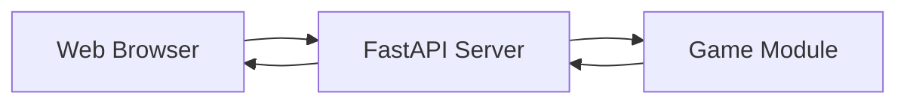
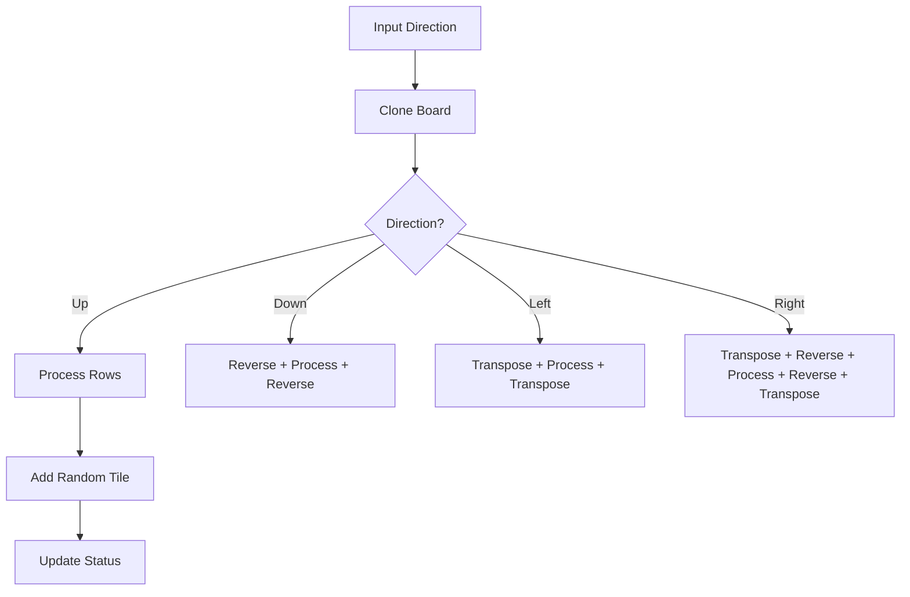
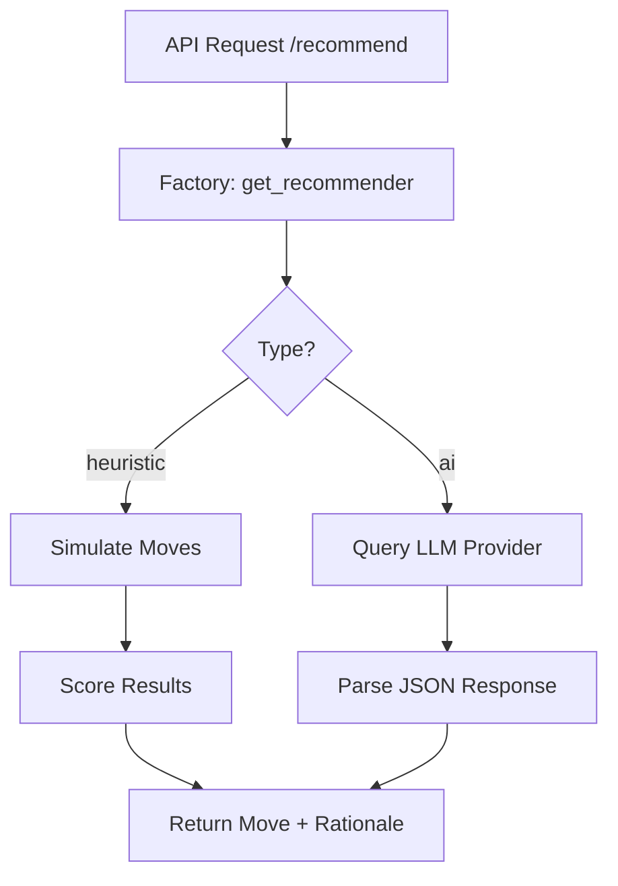

# Backend Schematics — 2048

**Tech Stack Summary:**  
- **Backend**: Python, FastAPI  
- **Game Logic**: Pure Python (`GameBoard`)  
- **Recommendation Engine**: Heuristic + optional AI via LLMs (Gemini / Ollama)  
- **Frontend Integration**: Serves React build files  
- **Testing**: Pytest  

---

## API Schematics

The API is built with **FastAPI**, chosen for its speed and native support for Pydantic models.

### API Topology

The API is stateless. It does not store the game board in memory; it receives the board from the client, calculates the move, and sends it back.

#### Endpoints

1.  **`POST /new`**
    - **Description**: Initializes a new game.
    - **Logic**: Instantiates a `GameBoard`, calls `add_random_number()` twice, and returns the grid.

2.  **`POST /move`**
    - **Description**: Processes a player move.
    - **Request**: `{ "grid": [...], "direction": "UP/DOWN/LEFT/RIGHT" }`
    - **Logic**: 
        - Validates the input grid.
        - Loads grid into `GameBoard`.
        - Executes the move.
        - Returns `{ "grid": [...], "status": "...", "largest_number": ... }`.

3.  **`POST /recommend`**
    - **Description**: Recommends the next move given the current state of the grid.
    - **Logic**: Feeds the current grid state to a recommender, and returns its recommendation, its rationale and the grid state if the move has been made.

### Static File Serving

The server is configured to serve the built React application:
- `/`: Serves the `index.html`.
- `/assets/`: Mounts the Vite assets directory for JS/CSS.

### Dependency Flow

---

## Game Schematics

The game logic is encapsulated in the `GameBoard` class, designed to be completely decoupled from any UI or API layer.

### Core Components

#### 1. GameBoard Class
The central coordinator. It maintains a 4x4 matrix of optional integers.
- **`move(direction)`**: The primary action. It clones the board, slides tiles, merges identical neighbors, and returns a new board if valid.
- **`add_random_number()`**: Automatically finds empty slots and places a '2' (90% chance) or '4' (10% chance).
- **`get_status()`**: Evaluates the board to see if the user reached 2048 or if no moves are left.

#### 2. Movement Logic
The engine uses a generic "compress and merge" strategy. To handle all 4 directions with one logic set, the board is transposed/reversed accordingly before and after processing.

### Data Flow

### State Definitions
- **ONGOING**: Moveable slots exist or a move was successful.
- **WON**: A tile value matches `GOAL_NUMBER` (2048).
- **LOST**: Grid is full and no adjacent tiles match.

---

## Recommender Schematics

The `recommendation` module is designed around a provider-agnostic interface, allowing the game to swap between local logic and remote AI without changing the API layer.

### Core Components

#### 1. Recommender Interface (`base.py`)
An abstract base class (ABC) that ensures all recommenders implement:
- **`suggest_move(grid)`**: Takes a 4x4 grid and returns a `(move, rationale)` tuple.

#### 2. Simulation Engine (`heuristic.py`)
The heuristic recommender uses the `GameBoard.__deepcopy__` method to perform non-destructive analysis.
- It simulates all 4 possible moves (Up, Down, Left, Right).
- It scores each resulting board based on "Monotonicity" (tile organization) and "Smoothness" (merging potential).
- The highest-scoring valid move is returned.

#### 3. AI Bridge (`ai.py`)
Encapsulates communication with LLMs.
- **Prompt Engineering**: Constructs a grid-aware prompt that asks the AI to act as a 2048 expert.
- **JSON Parsing**: Enforces a strict JSON output format from the model to maintain API compatibility.
- **Fallback Logic**: If an API call fails or the response is malformed, it defaults to a safe tactical move.

### Data Flow

### AI Prompt Structure
The module sends the following context to LLMs:
1. The current board matrix.
2. The objective (maximize tile value and empty space).
3. Requirements for a concise, strategic rationale.
