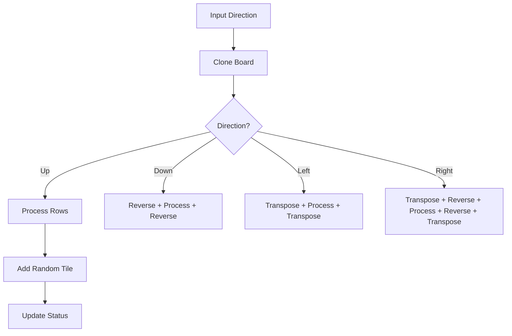

# Game Schematics

## Architecture

The game logic is encapsulated in the `GameBoard` class, designed to be completely decoupled from any UI or API layer.

### Core Components

#### 1. GameBoard Class
The central coordinator. It maintains a 4x4 matrix of optional integers.
- **`move(direction)`**: The primary action. It clones the board, slides tiles, merges identical neighbors, and returns a new board if valid.
- **`add_random_number()`**: Automatically finds empty slots and places a '2' (90% chance) or '4' (10% chance).
- **`get_status()`**: Evaluates the board to see if the user reached 2048 or if no moves are left.

#### 2. Movement Logic
The engine uses a generic "compress and merge" strategy. To handle all 4 directions with one logic set, the board is transposed/reversed accordingly before and after processing.

### Data Flow

### State Definitions
- **ONGOING**: Moveable slots exist or a move was successful.
- **WON**: A tile value matches `GOAL_NUMBER` (2048).
- **LOST**: Grid is full and no adjacent tiles match.
