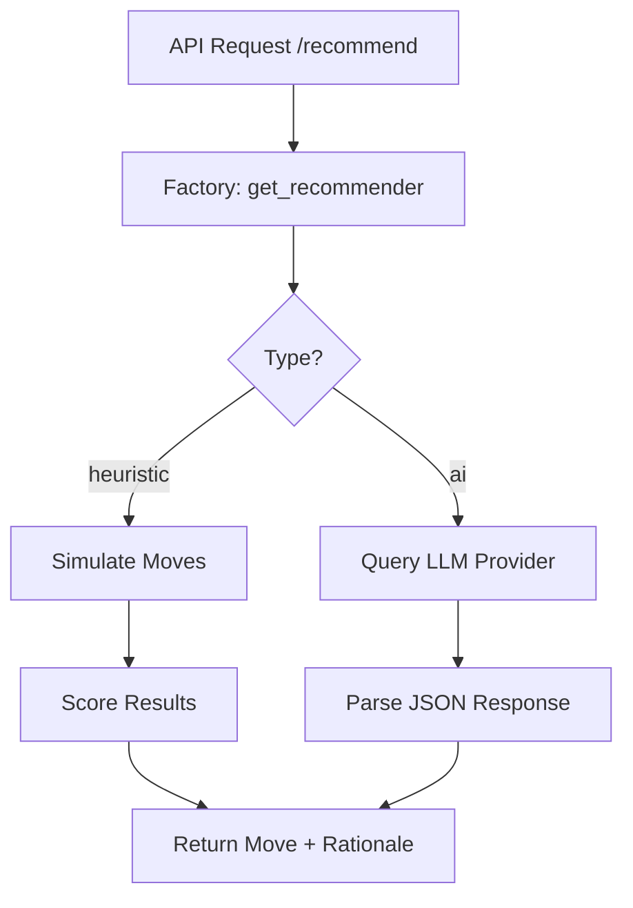

# Recommender Schematics

## Architecture

The `reco` module is designed around a provider-agnostic interface, allowing the game to swap between local logic and remote AI without changing the API layer.

### Core Components

#### 1. Recommender Interface (`base.py`)
An abstract base class (ABC) that ensures all recommenders implement:
- **`suggest_move(grid)`**: Takes a 4x4 grid and returns a `(move, rationale)` tuple.

#### 2. Simulation Engine (`heuristic.py`)
The heuristic recommender uses the `GameBoard.__copy__` method to perform non-destructive analysis.
- It simulates all 4 possible moves (Up, Down, Left, Right).
- It scores each resulting board based on "Monotonicity" (tile organization) and "Smoothness" (merging potential).
- The highest-scoring valid move is returned.

#### 3. AI Bridge (`ai.py`)
Encapsulates communication with LLMs.
- **Prompt Engineering**: Constructs a grid-aware prompt that asks the AI to act as a 2048 expert.
- **JSON Parsing**: Enforces a strict JSON output format from the model to maintain API compatibility.
- **Fallback Logic**: If an API call fails or the response is malformed, it defaults to a safe tactical move.

### Data Flow

### AI Prompt Structure
The module sends the following context to LLMs:
1. The current board matrix.
2. The objective (maximize tile value and empty space).
3. Requirements for a concise, strategic rationale.
