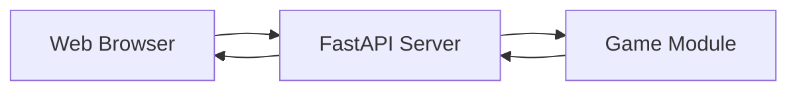

# Server Schematics

## Design

The server is built with **FastAPI**, chosen for its speed and native support for Pydantic models.

### API Topology

The server is stateless. It does not store the game board in memory; it receives the board from the client, calculates the move, and sends it back.

#### Endpoints

1.  **`POST /new`**
    - **Description**: Initializes a new game.
    - **Logic**: Instantiates a `GameBoard`, calls `add_random_number()` twice, and returns the grid.

2.  **`POST /move`**
    - **Description**: Processes a player move.
    - **Request**: `{ "grid": [...], "direction": "UP/DOWN/LEFT/RIGHT" }`
    - **Logic**: 
        - Validates the input grid.
        - Loads grid into `GameBoard`.
        - Executes the move.
        - Returns `{ "grid": [...], "status": "...", "largest_number": ... }`.

### Static File Serving

The server is configured to serve the built React application:
- `/`: Serves the `index.html`.
- `/assets/`: Mounts the Vite assets directory for JS/CSS.

### Dependency Flow

